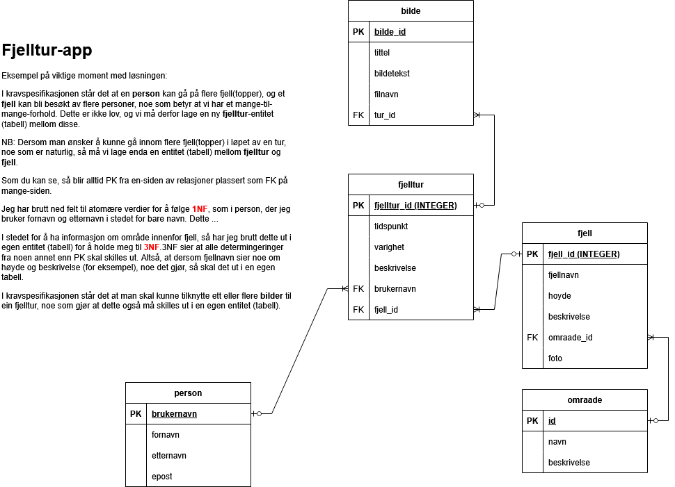

# Eksempel: Fjellturer (med TypeScript)

Meny:
- [Om denne guiden](#om-denne-guiden)
- [Hva er TypeScript?](#hva-er-typescript)
- [Planlegging](#planlegging)
- [Eksempel på datamodell](#eksempel-på-datamodell)
- [Lage databasen](#lage-databasen)
- [Oppgaver og løsningsforslag: SQL (AKA spørringer mot databasen)](#oppgaver-og-løsningsforslag-sql-aka-spørringer-mot-databasen)
- [Lage en webapplikasjon](#lage-en-webapplikasjon)
  - [Initialisere et nytt Node-prosjekt](#initialisere-et-nytt-node-prosjekt)
  - [Installere nødvendige avhengigheter](#installere-nødvendige-avhengigheter)
  - [Sette opp TypeScript](#sette-opp-typescript)
  - [Lage en enkel Express-server](#lage-en-enkel-express-server)
  - [Frontend-applikasjon: Vise alle fjellene](#frontend-applikasjon-vise-alle-fjellene)
  - [Frontend-applikasjon: Vise fjellturer for en gitt person](#frontend-applikasjon-vise-fjellturer-for-en-gitt-person)
  - [Stilsetting](#stilsetting)
  - [Frontend-applikasjon: Legge til nye fjellturer](#frontend-applikasjon-legge-til-nye-fjellturer)
- [Videre arbeid](#videre-arbeid)

## Om denne guiden

Dette er en frittstående TypeScript-versjon av "fjelltur-eksempelet". Den forutsetter ikke at du har gjort JavaScript-versjonen av dette eksempelet fra før - alt du trenger ligger i denne mappen (database, bilder og SQL-oppgaver er kopiert inn), og guiden forklarer alt fra bunnen av, akkurat som en vanlig steg-for-steg-guide.

Det eneste denne guiden forventer at du kan fra før, er vanlig JavaScript, samt grunnleggende bruk av Node.js, Express og SQL (spørringer mot en database). Det nye denne gangen er **TypeScript**, og guiden legger ekstra vekt på å forklare hva som faktisk er annerledes sammenlignet med å skrive vanlig JavaScript.

## Hva er TypeScript?

TypeScript er et språk laget av Microsoft som bygger direkte oven på JavaScript. Alt gyldig JavaScript er også gyldig TypeScript - men TypeScript lar deg i tillegg beskrive **hvilken type data** en variabel, et funksjonsparameter eller et returverdi skal inneholde (streng, tall, boolsk verdi, et objekt med bestemte felt, osv.).

Noen viktige poeng å ha med seg:

- **TypeScript kjører aldri direkte i en nettleser eller i Node.** Koden må først oversettes ("kompileres" eller "transpileres") til vanlig JavaScript. Det er denne vanlige JavaScript-koden som faktisk kjører til slutt.
- **Typene finnes bare mens du skriver og kompilerer koden.** Når koden er kompilert til JavaScript, er alle typer fjernet igjen - de finnes ikke i det hele tatt når koden kjører. Dette kalles gjerne "type erasure" (typesletting), og er kanskje det aller viktigste å forstå om TypeScript: du får ingen "typefeil" mens applikasjonen kjører, bare mens du skriver koden.
- **Fordelen** er at feil du ellers ville oppdaget først når koden krasjer (for eksempel at du sender inn et tall der en funksjon forventer en tekststreng), i stedet blir fanget opp med en gang, direkte i editoren, før du i det hele tatt kjører koden.
- **Ulempen** er at du må installere et kompileringsverktøy, og at det kommer et ekstra steg mellom "jeg har skrevet koden" og "koden kjører".

Gjennom denne guiden bygger vi den samme applikasjonen som i JavaScript-versjonen, men du vil se flere konkrete eksempler på hvordan TypeScript brukes i praksis - både på server-siden (Node/Express) og i nettleseren.

## Planlegging

Prosjektbeskrivelse: En venn av deg har kommet på en idè til en app, der folk kan registrere fjelltopper de går på gjennom året. Vennen har derimot ikke peiling på hva som kreves for å kunne lagre denne informasjonen, og ber deg om å hjelpe til med planlegging av "backend". I første omgang skal du altså lage en datamodell, og forklare den.

Etter et møte med vennen din, sitter du igjen med en liste med krav: 
- alle data er tilknyttet en person
- registrere fjell/fjelltopp
- registrere områder, som Jotunheimen, Hardanger, Bergen, Lofoten, Vossafjella, Femundsmarka etc. med tilhørende informasjon om disse
- registrere tidspunkt for turen
- registrere hvor lang tid turen tok 
- registrere en beskrivelse/oppsummering av turen 
- legge ved en eller flere bilder

Kommentarer:
- Når det gjelder område, som du blir bedt om å ha med, så er altså tanken at du kan lage noen typiske turområder eller regioner, ikke ferdigdefinerte fylker eller kommuner.
- En person kan gå mange turer til samme fjell.
- En fjelltopp kan bli besøkt av mange personer.
- Ta dine egne forutsetninger der det er aktuelt, og du mener det mangler informasjon. Skriv ned disse forutsetningene, og utvid gjerne datamodellen - og etter hvert databasen.

Lag datamodellen, og forhold deg til normaliseringsreglene.

## Eksempel på datamodell

<details>

<summary>Se løsningsforslag (etter du har forsøkt selv)</summary>



</details>

NB: Kommentarene er ikke grundige nok til å forklare alle deler av modellen, men er eksempel på hvordan du kan tenke når du skal gjøre dette.

NB2: Her kan man bare gå et fjell per tur, og det kan ikke gå flere personer på samme tur. Dette er for å gjøre det enklere å lage datamodellen, og senere databasen, men det er ikke nødvendigvis slik det må være i en virkelig applikasjon. Det er helt greit å utvide datamodellen, og gjøre den mer kompleks, hvis du ønsker det. Det viktigste er at du forstår hvordan de forskjellige delene henger sammen, og at du kan forklare det.

NB3: `fjelltur.db` inneholder også en `bilde`-tabell med noen testrader (bilder knyttet til en fjelltur), men de faktiske bildefilene disse radene peker på er ikke lagt ved i prosjektet. Dette er fordi vi ikke bruker denne tabellen i webapplikasjonen ennå - se ["Videre arbeid"](#videre-arbeid) for et forslag om å bygge ut løsningen med dette.

## Lage databasen

Bruk SQLite3, eller andre verktøy du er komfortabel med, for å lage databasen basert på datamodellen du har laget.

Legg også inn testdata, slik at du har noe å jobbe med når du skal lage spørringer og senere en webapplikasjon.

Lettvint løsning:
- Se [fjelltur.db](fjelltur.db) for en ferdig database som du kan bruke, og som inneholder testdata. Du kan åpne denne i et verktøy du foretrekker, og se hvordan den er bygget opp, og hvilke data som ligger i den.

## Oppgaver og løsningsforslag: SQL (AKA spørringer mot databasen)

Øv deg på å "spørre" databasen, og hente ut den informasjonen du er interessert i.

Her kan du finne oppgaver og løsningsforslag for SQL-spørringer mot denne databasen: [SQL - oppgaver og løsningsforslag](./SQL%20-%20oppgaver%20og%20løsningsforslag.md)

NB: SQL-spørringene dine ser helt like ut uansett om resten av applikasjonen skrives i JavaScript eller TypeScript - SQL er sitt eget språk, og påvirkes ikke av hvilket programmeringsspråk som bruker det.

## Lage en webapplikasjon

Vi skal nå lage en enkel webapplikasjon som kan hente data fra SQLite-databasen, og vise det i en nettleser. Vi skal bruke `Node.js`, `Express` og `better-sqlite3` akkurat som i en vanlig JavaScript-løsning, men denne gangen skriver vi koden i TypeScript.

Her følger en steg-for-steg guide for hvordan du kan lage dette.

### Initialisere et nytt Node-prosjekt

Lag deg først en ny mappe for prosjektet, og flytt database-filen inn i denne.

Deretter initialiser du et nytt Node-prosjekt i denne mappen. Åpne terminalen, naviger til mappen, og kjør følgende kommando:

```bash
npm init -y
```

Kontroller at `package.json` har blitt opprettet.

Merk deg at du skal lagre all koden for webapplikasjonen din i denne mappen, og det er her du skal installere nødvendige avhengigheter. Følg med på instruksjonene, da du etter hvert må opprette nye mapper og filer for å kunne lage en fungerende applikasjon.

#### Feilsøkingstips

Dersom du får problemer med å kjøre `npm init`, eller andre kommandoer, så kan det være lurt å sjekke at du har Node.js og npm installert på maskinen din. Du kan sjekke dette ved å kjøre `node -v` og `npm -v` i terminalen. Hvis du ikke har disse installert, kan du laste ned og installere Node.js fra [nodejs.org](https://nodejs.org/).

Et annet problem som mange får er hvilke rettigheter du har til å kjøre script. Du kan tillate dette ved å skrive følgende kommando i terminalen (dersom du bruker PowerShell på Windows):
```bash
Set-ExecutionPolicy -ExecutionPolicy RemoteSigned -Scope CurrentUser
```  

Dette vil tillate deg å kjøre script som er laget på din egen maskin, men ikke script som er lastet ned fra internett, uten at du har godkjent det først.

Et tredje problem du kan støte på, er at `better-sqlite3` (se neste steg) må kompileres for nøyaktig den Node-versjonen du bruker. Dersom installasjonen feiler med feilmeldinger om kompilering, kan det være lurt å sjekke at du bruker en oppdatert LTS-versjon ("Long Term Support") av Node.js, siden helt ferske Node-versjoner ikke alltid støttes av `better-sqlite3` med en gang.

### Installere nødvendige avhengigheter

Fortsatt fra terminalen; kjør følgende kommando for å installere Express, better-sqlite3 og CORS - de samme "vanlige" avhengighetene som i en JavaScript-løsning:

```bash
npm install express better-sqlite3 cors
```

I tillegg trenger vi noen verktøy som bare brukes mens vi utvikler, ikke når applikasjonen faktisk kjører hos en bruker. Disse installeres som "devDependencies" med `-D`-flagget:

```bash
npm install -D typescript tsx @types/node @types/express @types/cors @types/better-sqlite3
```

Hva er alt dette?
- `typescript` er selve TypeScript-kompilatoren (`tsc`), som oversetter TypeScript-kode til vanlig JavaScript.
- `tsx` er et verktøy som kjører TypeScript-filer direkte, uten at du manuelt må kompilere dem til JavaScript først. Dette bruker vi for å kjøre serveren vår mens vi utvikler.
- `@types/node`, `@types/express`, `@types/cors` og `@types/better-sqlite3` er **typedefinisjoner** - egne pakker som beskriver hvilke typer alle funksjonene og objektene i Node, Express, CORS og better-sqlite3 har. Bibliotekene selv er skrevet i vanlig JavaScript og vet ingenting om TypeScript, så disse pakkene finnes for å "oversette" dem til TypeScript-språket, slik at TypeScript kan hjelpe deg mens du bruker dem.

Kontroller at `package.json` har blitt oppdatert med de nye avhengighetene under både `"dependencies"` og `"devDependencies"`, og at det har blitt opprettet en `node_modules`-mappe.

### Ikke last opp node_modules eller kompilert kode til GitHub

Det er vanlig praksis å ikke laste opp `node_modules`-mappen til GitHub, da denne kan være veldig stor, og den uansett inneholder filer som kan gjenopprettes ved å kjøre `npm install` basert på `package.json`. Det samme gjelder mapper med **kompilert** JavaScript-kode (som du snart skal lage) - siden denne koden genereres automatisk ut fra TypeScript-filene dine, trenger den heller ikke lastes opp.

Opprett en `.gitignore`-fil i rotmappen av prosjektet ditt, og legg til følgende linjer:

```
node_modules
public/dist
```

Dette vil fortelle Git at den skal ignorere både `node_modules`-mappen og den kompilerte frontend-koden (som vi snart skal lage i `public/dist`). Kontroller at `.gitignore`-filen er opprettet, og at den inneholder disse linjene.

### Sette opp TypeScript

For at TypeScript-kompilatoren skal vite *hvordan* den skal kompilere koden din, trenger den en konfigurasjonsfil som heter `tsconfig.json`.

Vi trenger faktisk **to** slike konfigurasjonsfiler i dette prosjektet, fordi vi skal skrive TypeScript to steder som kjører i to helt forskjellige miljøer:
- Server-koden kjører i **Node.js**, og har tilgang til ting som filsystemet og databasen, men vet ingenting om `document` eller nettleseren.
- Frontend-koden kjører i **nettleseren**, og har tilgang til ting som `document` og `window`, men vet ingenting om filsystemet.

Disse to miljøene har rett og slett ulike globale "byggeklosser" tilgjengelig, og vi må fortelle TypeScript hvilket miljø hver del av koden skal kjøre i.

Lag en fil som heter `tsconfig.json` i rotmappen av prosjektet (for **server**-koden):

```json
{
  "compilerOptions": {
    "target": "ES2022",
    "lib": ["ES2022"],
    "module": "CommonJS",
    "esModuleInterop": true,
    "forceConsistentCasingInFileNames": true,
    "strict": true,
    "skipLibCheck": true,
    "noEmit": true
  },
  "include": ["app.ts"]
}
```

Noen av de viktigste innstillingene:
- `"target"` bestemmer hvilken versjon av JavaScript koden skal oversettes til.
- `"strict": true` skrur på TypeScript sine strengeste kontroller - dette er anbefalt, siden det er nettopp disse kontrollene som fanger opp flest feil for deg.
- `"noEmit": true` betyr at vi ikke skal bruke `tsc` til å faktisk *lage* JavaScript-filer for serveren vår her. Det er fordi vi bruker `tsx` til å kjøre serveren direkte (se neste avsnitt) - denne konfigurasjonsfilen brukes i stedet bare til å *sjekke* om koden vår har typefeil.

### Lage en enkel Express-server

Vi lager en enkel Express-server som kan håndtere forespørsler og hente data fra SQLite-databasen - akkurat som i en JavaScript-løsning, men nå med typer.

Startkode, lag en fil som heter `app.ts`:

```typescript
// Server-bit, setter opp en Express-app
import express, { Request, Response } from 'express';
const app = express();

const PORT = 3000;

// Databasen
import Database from 'better-sqlite3';
const db = new Database('fjelltur.db');

// CORS-middleware for å tillate forespørsler fra andre domener
import cors from 'cors';
app.use(cors());

// Type som beskriver formen på hvert fjell-objekt vi henter fra databasen i ruten under.
// Denne typen finnes bare i TypeScript-koden, og forsvinner igjen når koden kompileres til JavaScript.
interface FjellInfo {
    fjellnavn: string;
    hoyde: number;
    beskrivelse: string;
    foto: string;
}

// Eksempel på en rute som henter alle fjell, beskrivelse, høydene og bilde deres
app.get('/api/fjell', (req: Request, res: Response) => {
    // Her forteller vi TypeScript nøyaktig hvilken form dataene fra denne spørringen har,
    // ved å sende med "FjellInfo" som en generisk type til prepare(). Da vet TypeScript at
    // "rows" er en liste (array) av FjellInfo-objekter, og du får blant annet autofullføring
    // på f.eks. "rows[0].fjellnavn" i editoren din.
    const rows = db.prepare<[], FjellInfo>('SELECT fjellnavn, hoyde, beskrivelse, foto FROM fjell').all();
    res.json(rows);
});

// Åpner en viss port på serveren, og starter serveren
app.listen(PORT, () => {
    console.log(`Server kjører på http://localhost:${PORT}`);
});
```

Legg merke til noen forskjeller fra vanlig JavaScript:
- Vi bruker `import ... from '...'` i stedet for `require('...')`. Dette er ikke unikt for TypeScript (moderne JavaScript støtter det samme), men det er den vanlige måten å skrive det på i TypeScript-prosjekter.
- Parameterne `req` og `res` er skrevet med typene `Request` og `Response`, som kommer fra Express sine egne typedefinisjoner (`@types/express`). Dette gjør at du får autofullføring og feilmeldinger dersom du for eksempel skriver `res.jsonn(...)` i stedet for `res.json(...)`.
- `db.prepare<[], FjellInfo>(...)` bruker det som kalles **generics** i TypeScript - en måte å si "denne funksjonen skal jobbe med akkurat denne typen data" til en funksjon som ellers ville vært generell. Det første argumentet (`[]`) sier at spørringen ikke tar imot noen parametere, og det andre (`FjellInfo`) sier hva slags rader den returnerer.

#### Kjøre serveren

Vanlig JavaScript kan kjøres direkte av Node (`node app.js`), men det kan ikke TypeScript-filer. Node forstår ikke TypeScript-syntaks i utgangspunktet. Vi har derfor installert `tsx`, som oversetter og kjører TypeScript-koden i ett og samme steg.

Legg til følgende i `"scripts"` i `package.json`:

```json
"scripts": {
    "dev": "tsx app.ts",
    "typecheck": "tsc --noEmit -p tsconfig.json"
}
```

Start serveren ved å kjøre:

```bash
npm run dev
```

Kontroller at serveren starter uten feil, at du kan nå `http://localhost:3000/api/fjell` i nettleseren, og se dataene fra databasen. Hvilket format får du dataene i?

NB: `tsx` sjekker **ikke** om typene dine faktisk stemmer - den bytter bare raskt ut TypeScript-syntaksen med vanlig JavaScript og kjører den, uten å bry seg om typefeil. Dette gjør at appen starter raskt, men det betyr at du selv må huske å sjekke typene innimellom. Det gjør du med:

```bash
npm run typecheck
```

Prøv gjerne å endre `res.json(rows)` til noe feil, som `res.json(rows.fjellnavn)` (uten `[0]` eller løkke), lagre fila, og kjør `npm run typecheck`. Du vil se at TypeScript oppdager feilen - selv om `npm run dev` fortsatt hadde startet serveren uten å klage! Husk å rette opp feilen igjen etterpå.

## Frontend-applikasjon: Vise alle fjellene

Vi skal nå bruke `fetch` for å hente data fra API-et ditt, og vise det i en enkel frontend-applikasjon - denne gangen skrevet i TypeScript.

Vi må utvide `app.ts` for å servere statiske filer, slik at vi kan ha en HTML-fil og tilhørende TypeScript og CSS. Legg til den følgende linjen i `app.ts` (rett under der du oppretter `app`):

```typescript
// Middleware for å servere statiske filer fra "public" mappen
app.use(express.static('public'));
```

Opprett en mappe som heter `public`, og lag tre filer her:
- `index.html`
- `index.ts`
- `index.css`

Koble disse filene sammen.

I `index.html` kan du lage en enkel struktur for å vise dataene, og inkludere `index.css`. For eksempel:

```html
<!DOCTYPE html>
<html lang="nb">
<head>
    <meta charset="UTF-8">
    <meta name="viewport" content="width=device-width, initial-scale=1.0">
    <title>Fjell</title>
    <script type="module" src="dist/index.js"></script>
    <link rel="stylesheet" href="index.css">
</head>
<body>
    <!-- Fylles ut av JS -->
</body>
</html>
```

Legg merke til at `<script>`-taggen ikke peker på `index.ts`, men på `dist/index.js` - en fil som ennå ikke finnes! Det er fordi nettleseren, akkurat som Node, ikke forstår TypeScript. Den forstår bare vanlig JavaScript. Vi må derfor **kompilere** `index.ts` til en vanlig JavaScript-fil (`dist/index.js`) før nettleseren kan kjøre den. Det kommer vi tilbake til om litt.

Du ser også `type="module"` på `<script>`-taggen i stedet for `defer` - dette forklarer vi mer om lenger ned.

I `index.ts` kan du bruke `fetch` for å hente data fra API-et ditt, og vise det i nettleseren. NB: Koden nedenfor skriver bare ut dataene i konsollen, du må selv lage HTML-elementer og legge dataene inn i disse for å vise det på siden.

```typescript
// Dette tomme "export {}"-uttrykket gjør filen til en egen modul i TypeScript sine øyne.
// Uten den ville alle .ts-filene i "public"-mappen delt samme globale navnerom når vi
// kompilerer dem (selv om nettleseren bare laster inn én fil om gangen på hver side), og det
// ville gitt feilmeldinger dersom to filer har funksjoner eller variabler med samme navn.
export {};

// Beskriver formen på hvert fjell-objekt vi forventer å få tilbake fra API-et
interface Fjell {
    fjellnavn: string;
    hoyde: number;
    beskrivelse: string;
    foto: string;
}

async function fetchData(): Promise<void> {
    const response = await fetch('/api/fjell');

    // NB: response.json() returnerer typen "any" i TypeScript sine øyne - TypeScript sjekker
    // ikke at dataene faktisk ser slik ut i praksis, den stoler bare blindt på typen vi
    // oppgir her ("Fjell[]"). Dette er en av grensene for hva TypeScript kan hjelpe deg med:
    // den vet ingenting om hva som faktisk kommer tilbake fra nettverket.
    const data: Fjell[] = await response.json();
    console.log(data);

    // Her kan du gjøre noe med dataen (vise det frem)
}

fetchData();
```

<details>
<summary>Løsningsforslag for å vise dataene i nettleseren, og ikke bare i konsollen (trykk for å vise)</summary>

```typescript
    for (const fjell of data) {
        const fjellDiv = document.createElement('div');
        fjellDiv.classList.add('kort');
        fjellDiv.innerHTML = `
            <h3>${fjell.fjellnavn}</h3>
            <p>Høyde: ${fjell.hoyde} meter</p>
            <p>Beskrivelse: ${fjell.beskrivelse}</p>
            
        `;
        document.body.appendChild(fjellDiv);
    }
```
</details>

Du kan se all koden for dette i [`public`-mappen](./public/), og du kan også se hvordan jeg har gjort det i CSS for å style det litt.

### Kompilere frontend-koden

I motsetning til server-koden (som vi kjører direkte med `tsx`), *må* frontend-koden faktisk kompileres til ferdige JavaScript-filer, siden det er disse filene nettleseren laster inn og kjører.

Lag en egen `tsconfig.json` inne i `public`-mappen (altså `public/tsconfig.json`), siden denne koden kjører i et annet miljø (nettleseren) enn server-koden:

```json
{
  "compilerOptions": {
    "target": "ES2020",
    "lib": ["ES2020", "DOM"],
    "module": "ES2020",
    "rootDir": ".",
    "outDir": "dist",
    "strict": true,
    "forceConsistentCasingInFileNames": true,
    "skipLibCheck": true,
    "noEmitOnError": true
  },
  "include": ["*.ts"]
}
```

Det viktigste som er forskjellig fra `tsconfig.json` i rotmappen:
- `"lib": ["ES2020", "DOM"]` inkluderer typer for nettleser-ting som `document`, `window` og `fetch`. Uten `"DOM"` her ville TypeScript ikke visst hva `document` engang var.
- `"outDir": "dist"` sier at de ferdig kompilerte JavaScript-filene skal legges i en undermappe som heter `dist` (kort for "distribution").
- `"noEmitOnError": true` betyr at TypeScript **nekter** å lage JavaScript-filer dersom koden har typefeil. Dette er en fin sikkerhetsmekanisme for nettopp frontend-koden: du vil aldri risikere å teste en gammel, utdatert versjon av koden i nettleseren fordi den nyeste versjonen ikke kompilerte.

Legg så til et par nye kommandoer i `"scripts"` i `package.json`:

```json
"scripts": {
    "dev": "tsx app.ts",
    "typecheck": "tsc --noEmit -p tsconfig.json",
    "build": "tsc -p public/tsconfig.json",
    "build:watch": "tsc -p public/tsconfig.json --watch"
}
```

Kjør så:

```bash
npm run build
```

Kontroller at det har dukket opp en `dist`-mappe inne i `public`, med en fil som heter `index.js`. Åpne den gjerne, og se hvordan den ser ut sammenlignet med `index.ts` - legg merke til at alle typene er borte!

Husk at du må kjøre `npm run build` på nytt hver gang du endrer en `.ts`-fil i `public`-mappen, for at endringene skal vises i nettleseren. Ønsker du at dette skal skje automatisk mens du jobber, kan du i stedet kjøre `npm run build:watch` i et eget terminalvindu - da kompilerer TypeScript på nytt hver gang du lagrer en fil.

Start serveren (`npm run dev`), åpne `http://localhost:3000/index.html` i nettleseren, og kontroller at fjellene vises.

#### Hvorfor `type="module"` og ikke `defer`?

Siden `index.ts` inneholder et `export {}`-uttrykk (se koden over), regner TypeScript filen som en **modul**, og kompilerer den deretter til en ES-modul i JavaScript. Slike moduler kan bare lastes inn i nettleseren med `<script type="module">`, ikke som et vanlig script. Det er derfor `<script>`-taggen i `index.html` bruker `type="module"` i stedet for `defer` slik du kanskje har sett før - heldigvis oppfører moduler seg uansett som om de har `defer` i utgangspunktet, så funksjonaliteten er den samme.

## Frontend-applikasjon: Vise fjellturer for en gitt person

Nå skal vi lage en dropdown-meny som lar oss velge en person, og når vi har valgt en person, så skal vi hente ut alle fjellturene til den personen, og vise det i nettleseren.

Her deler vi problemet opp i flere deler:
1. Lage en rute i Express som henter ut alle personer, og deretter bruke dette for å fylle dropdown-menyen.
2. Lage en rute i Express som henter ut alle fjellturene til en gitt person, basert på brukernavn, og returnerer dette som JSON.
3. Lage en event listener på dropdown-menyen, som henter ut den valgte personen, og deretter gjør et API-kall for å hente ut fjellturene til denne personen, og viser det i nettleseren.

### Hente ut alle personer og fylle dropdown-menyen

Legg til følgende rute i `app.ts`:

```typescript
interface Person {
    brukernavn: string;
}

// Eksempel på en rute som henter alle brukernavnene til alle personene i databasen
app.get('/api/personer', (req: Request, res: Response) => {
    const rows = db.prepare<[], Person>('SELECT brukernavn FROM person').all();
    res.json(rows);
});
```

Merk at vi her bare henter ut `brukernavn`-kolonnen, og ikke andre kolonner som for eksempel `fornavn` eller `etternavn`. Dette er fordi vi i dette eksempelet bare trenger brukernavnene for å kunne hente ut fjellturene til en person senere. Dersom du ønsker å vise fornavn og etternavn i dropdown-menyen, så kan du endre SQL-spørringen (og `Person`-typen) til å hente ut disse kolonnene også, og returnere det som JSON.

Deretter lager vi klar HTML-koden i en fil vi kaller `eks-fjellturer-for-person.html`, som inneholder en dropdown-meny for å velge person, og en container for å vise fjellturene til den valgte personen. Denne filen legger du i `public`-mappen.:

```html
<!DOCTYPE html>
<html lang="nb">
<head>
    <meta charset="UTF-8">
    <meta name="viewport" content="width=device-width, initial-scale=1.0">
    <title>Fjellturer for person</title>
    <script type="module" src="dist/eks-fjellturer-for-person.js"></script>
    <link rel="stylesheet" href="eks-fjellturer-for-person.css">
</head>
<body>
    <!-- Venstre panel: personvalg -->
    <div id="sidebar">
        <h2>Velg person</h2>
        <select id="personDropdown" title="Personvalg">
            <option value="">Velg en person</option>
        </select>
    </div>

    <!-- Høyre panel: fjellturer for valgt person, fylles ut av JS -->
    <div id="fjellturerContainer"></div>
</body>
</html>
```

Det siste steget i denne delen er å fylle ut dropdown-menyen med brukernavnene til alle personene i databasen. Dette gjør vi i den tilkoblede filen `eks-fjellturer-for-person.ts`:

```typescript
// Gjør filen til en egen modul, se forklaring i index.ts
export {};

interface Person {
    brukernavn: string;
}

// Fyller ut en dropdown (select) med brukernavnene på alle personene i databasen
async function hentPersoner(): Promise<void> {
    const response = await fetch('/api/personer');
    const personer: Person[] = await response.json();

    // document.getElementById(...) returnerer typen "HTMLElement | null" i TypeScript,
    // fordi TypeScript ikke har noen måte å vite på om et element med denne id-en faktisk
    // finnes i HTML-en. Vi vet at det gjør det (vi har jo laget HTML-en selv), så vi bruker
    // "as" for å fortelle TypeScript nøyaktig hvilket element det er snakk om, og dermed
    // fjerne "null" fra typen.
    const dropdown = document.getElementById('personDropdown') as HTMLSelectElement;

    for (const person of personer) {
        const option = document.createElement('option');
        option.value = person.brukernavn;
        option.textContent = person.brukernavn;
        dropdown.appendChild(option);
    }
}
document.addEventListener('DOMContentLoaded', hentPersoner);
```

Kontroller at dropdown-menyen fylles ut med brukernavnene til alle personene i databasen når du kompilerer (`npm run build`) og åpner `eks-fjellturer-for-person.html` i nettleseren.

### Hente ut alle turene til en gitt person

Nå når dropdown-menyen er fylt ut, så skal vi lage en rute i Express som kan hente ut alle fjellturene til en gitt person, basert på brukernavn. Dette gjør vi ved å bruke URL-parametere i Express.

Legg til følgende rute i `app.ts`:

```typescript
interface FjellturForPerson {
    fjellnavn: string;
    tidspunkt: string;
}

app.get('/api/fjellturer/:brukernavn', (req: Request<{ brukernavn: string }>, res: Response) => {
    const brukernavn = req.params.brukernavn;

    const rows = db.prepare<[string], FjellturForPerson>(`
        SELECT fjell.fjellnavn, fjelltur.tidspunkt
        FROM person
        JOIN fjelltur ON person.brukernavn = fjelltur.brukernavn
        JOIN fjell ON fjelltur.fjell_id = fjell.fjell_id
        WHERE person.brukernavn = ?
    `).all(brukernavn);

    res.json(rows);
});
```

Ruten over tar inn et `brukernavn` som en URL-parameter, og bruker dette for å hente ut alle fjellene som denne personen har gått på. Legg merke til `Request<{ brukernavn: string }>` - her forteller vi TypeScript nøyaktig hvilke URL-parametere denne ruten har, slik at `req.params.brukernavn` blir typet som en vanlig streng i stedet for `any`.

Det du nettopp gjorde oppleves kanskje litt vanskelig, men tenk på alternativet, der du måtte lage en ny rute for hver person du vil hente ut fjellturene til, og hardkode navnet på personen i SQL-spørringen. Det ville vært en særs tungvint løsning, og det er derfor vi bruker URL-parametere (som `:brukernavn` i ruten) for å gjøre det mer fleksibelt.

```typescript
// Eksempel om å hente alle fjellene som en gitt person har gått
// Et alternativ som er en veldig dårlig løsning, fordi vi hardkoder navnet på personen i SQL-spørringen,
// og da må vi lage en ny rute for hver person vi vil hente ut fjellene til
app.get('/api/fjellturer_hausnes', (req: Request, res: Response) => {
    const rows = db.prepare<[], FjellturForPerson>(`
        SELECT fjell.fjellnavn, fjelltur.tidspunkt
        FROM person 
        JOIN fjelltur ON person.brukernavn = fjelltur.brukernavn 
        JOIN fjell ON fjelltur.fjell_id = fjell.fjell_id 
        WHERE person.brukernavn = 'hausnes'`).all();
    res.json(rows);
});
```

Når ruten er på plass i `app.ts`, så kan du teste den ved å åpne `http://localhost:3000/api/fjellturer/hausnes` i nettleseren, og se at du får ut alle fjellene som personen med brukernavn "hausnes" har gått på. Sjekk deretter et annet brukernavn for å se at det fungerer for flere personer (for eksempel `http://localhost:3000/api/fjellturer/harry`).

For å faktisk bruke denne ruten i frontend-applikasjonen, så må du lage en event listener på dropdown-menyen, som henter ut den valgte personen, og deretter gjør et API-kall for å hente ut fjellturene til denne personen, og viser det i nettleseren.

HTML-siden har du allerede laget, og den inneholder en dropdown-meny med id `personDropdown`, og en container med id `fjellturerContainer` der vi skal vise fjellturene til den valgte personen.

I filen `eks-fjellturer-for-person.ts` skal du nå **legge til** følgende:

```typescript
interface FjellturForPerson {
    fjellnavn: string;
    tidspunkt: string;
}

// Når en person er valgt, henter og viser alle fjellturene til den personen
const personDropdown = document.getElementById('personDropdown') as HTMLSelectElement;
personDropdown.addEventListener('change', async function () {
    // Siden "personDropdown" er en HTMLSelectElement, vet TypeScript at "this" også er det
    // inne i denne funksjonen, og dermed at "this.value" er en vanlig streng.
    const brukernavn = this.value;
    console.log(`Valgt person: ${brukernavn}`);
    if (brukernavn) {
        const response = await fetch(`/api/fjellturer/${encodeURIComponent(brukernavn)}`);
        if (!response.ok) throw new Error(`HTTP ${response.status}`);
        const fjellturer: FjellturForPerson[] = await response.json();
        
        // Sjekker at vi har fått data tilbake, og viser det i konsollen
        console.log(fjellturer); // Her kan du erstatte dette med kode for å vise fjellturene i UI

        // Skriver turene til HTML
        // Først viser vi en overskrift med hvilken person vi viser turene for
        const turerDiv = document.getElementById('fjellturerContainer') as HTMLDivElement;
        turerDiv.innerHTML = `<h2>Fjellturer for ${brukernavn}</h2>`;
        // Så viser vi en liste med alle fjellturene
        const ul = document.createElement('ul');
        for (const tur of fjellturer) {
            const li = document.createElement('li');
            li.textContent = tur.fjellnavn;
            ul.appendChild(li);
        }
        turerDiv.appendChild(ul);
    }
});
```

Som du kan se i koden over, så har vi laget en event listener på dropdown-menyen, som lytter etter endringer (når en person blir valgt). Når en person blir valgt, så henter vi ut brukernavnet til den valgte personen, og gjør et API-kall til ruten vi laget tidligere for å hente ut fjellturene til denne personen. Når vi får dataene tilbake, så viser vi det i konsollen, og deretter skriver vi det ut i HTML ved å lage en overskrift med navnet på personen, og en liste med alle fjellturene.

Husk å kjøre `npm run build` (eller ha `npm run build:watch` kjørende) etter at du har endret `eks-fjellturer-for-person.ts`.

## Stilsetting

Du kan se CSS-filen `eks-fjellturer-for-person.css` [her](./public/) for et eksempel på hvordan du kan style dette, og gjøre det mer visuelt tiltalende. CSS-en er akkurat den samme uansett om applikasjonen bak er skrevet i JavaScript eller TypeScript - stilsetting påvirkes ikke av dette valget.

<details>
<summary>Kjapp visning av CSS (trykk for å vise)</summary>

```css
/* Deler designet inn i to deler, med select-elementet til venstre, og resultatene til høyre. */

* {
    box-sizing: border-box;
    margin: 0;
    padding: 0;
}

body {
    display: flex;
    flex-direction: row;
    min-height: 100vh;
    font-family: 'Segoe UI', Arial, sans-serif;
    background: linear-gradient(135deg, #1a1a2e 0%, #16213e 50%, #0f3460 100%);
    color: #e0e0e0;
}

/* Venstre panel – personvalg */
#sidebar {
    width: 220px;
    min-height: 100vh;
    background: rgba(255, 255, 255, 0.05);
    backdrop-filter: blur(10px);
    border-right: 1px solid rgba(255, 255, 255, 0.1);
    padding: 40px 20px;
    display: flex;
    flex-direction: column;
    gap: 12px;
}

#sidebar h2 {
    font-size: 14px;
    letter-spacing: 2px;
    text-transform: uppercase;
    color: #a0c4ff;
    margin-bottom: 8px;
}

#personDropdown {
    width: 100%;
    padding: 10px 12px;
    font-size: 15px;
    background: rgba(255, 255, 255, 0.08);
    color: #e0e0e0;
    border: 1px solid rgba(160, 196, 255, 0.4);
    border-radius: 8px;
    cursor: pointer;
    outline: none;
    appearance: none;
    background-image: url("data:image/svg+xml,%3Csvg xmlns='http://www.w3.org/2000/svg' width='12' height='8' viewBox='0 0 12 8'%3E%3Cpath fill='%23a0c4ff' d='M6 8L0 0h12z'/%3E%3C/svg%3E");
    background-repeat: no-repeat;
    background-position: right 12px center;
    transition: border-color 0.2s, background-color 0.2s;
}

#personDropdown:hover,
#personDropdown:focus {
    border-color: #a0c4ff;
    background-color: rgba(160, 196, 255, 0.12);
}

#personDropdown option {
    background: #16213e;
    color: #e0e0e0;
}

/* Høyre panel – resultater */
#fjellturerContainer {
    flex: 1;
    padding: 40px;
    overflow-y: auto;
}

#fjellturerContainer h2 {
    font-size: 22px;
    font-weight: 600;
    color: #a0c4ff;
    margin-bottom: 20px;
    padding-bottom: 10px;
    border-bottom: 1px solid rgba(160, 196, 255, 0.3);
}

#fjellturerContainer ul {
    list-style: none;
    display: flex;
    flex-direction: column;
    gap: 10px;
}

#fjellturerContainer li {
    background: rgba(255, 255, 255, 0.05);
    border: 1px solid rgba(255, 255, 255, 0.08);
    border-radius: 8px;
    padding: 14px 18px;
    font-size: 16px;
    transition: background 0.2s, border-color 0.2s;
}

#fjellturerContainer li:hover {
    background: rgba(160, 196, 255, 0.1);
    border-color: rgba(160, 196, 255, 0.4);
}

```
</details>

## Frontend-applikasjon: Legge til nye fjellturer

Nå har du en fungerende frontend-applikasjon som kan hente ut og vise data fra databasen, men det er ikke så gøy hvis du ikke kan legge til nye data også. I denne delen skal vi lage en form i frontend-applikasjonen, der brukeren kan legge inn informasjon om en ny fjelltur, og deretter sende dette til serveren via et POST-kall. På serveren må du lage en rute som håndterer dette POST-kallet, og legger den nye fjellturen inn i databasen.

### Lage en form i HTML for registrering

Se hvilke felt du trenger å fylle ut, enten basert på datammodellen eller ved å se på databasen. Lag deretter en form i HTML som inneholder input-felt for alle disse feltene. For eksempel kan du lage dropdown-menyer for å velge person og fjell, og vanlige input-felt for å legge inn tidspunkt, tid brukt, og beskrivelse.

Prøv selv!

Løsningsforslag (`eks-registrere-ny-tur.html`):

```html
<form id="ny-tur-form">
    <h1>Registrer ny fjelltur</h1>
    
    <!-- Dropdown for å velge brukernavn: -->
    <label for="brukernavn-dropdown">Brukernavn:</label>
    <select id="brukernavn-dropdown" name="brukernavn-dropdown" required>
        <!-- Fylles ut av JS -->
    </select>
    
    <!-- Dropdown for å velge fjell: -->
    <label for="fjell-dropdown">Fjell:</label>
    <select id="fjell-dropdown" name="fjell-dropdown" required>
        <!-- Fylles ut av JS -->
    </select>

    <!-- Tidspunkt for turen: -->
    <label for="tidspunkt">Tidspunkt for turen:</label>
    <input type="date" id="tidspunkt" name="tidspunkt" required>

    <!-- Varighet for turen (i minutter): -->
    <label for="varighet">Varighet (minutter):</label>
    <input type="number" id="varighet" name="varighet" required>

    <!-- Beskrivelse av turen -->
    <label for="beskrivelse">Beskrivelse:</label>
    <textarea id="beskrivelse" name="beskrivelse" required></textarea>

    <button type="submit">Registrer tur</button>

    <!-- Lenke til oversikt over registrerte turer -->
    <a href="eks-fjellturer-for-person.html" class="nav-lenke">Se hvilke fjell en person har gått</a>
</form>
```

Husk `<script type="module" src="dist/eks-registrere-ny-tur.js"></script>` i `<head>`, akkurat som på de andre sidene.

### Fyll ut dropdown-menyer med data fra databasen

For at brukeren skal kunne velge en person og et fjell når de skal registrere en ny fjelltur, så må vi fylle ut dropdown-menyer for disse feltene med data fra databasen. Dette gjør vi ved å lage to ruter i Express som henter ut alle personer og alle fjell, og deretter bruke disse rutene i frontend for å fylle ut. Dette gjorde du tidligere i oppgaven (personer), så forsøk gjerne selv først med fjell.

NB: Vi forenkler selvsagt en hel del siden vi i denne løsningen kan legge inn fjellturer for andre enn oss selv (vi kan velge andre brukere enn oss selv). Se egen guide for hvordan du kan implementere autentisering og autorisasjon senere, for å gjøre det mer realistisk dersom du ønsker det.

#### Fylle ut dropdown for personer

I Express, bruk ruten du laget tidligere i `app.ts` for å hente ut alle personer (`/api/personer`).

I filen `eks-registrere-ny-tur.ts` legger du til følgende kode for å hente ut alle personer og fylle ut dropdown-menyen for brukernavn:

```typescript
// Gjør filen til en egen modul, se forklaring i index.ts
export {};

interface Person {
    brukernavn: string;
}

// Kode for å fylle ut en dropdown med alle brukernavn
async function hentPersoner(): Promise<void> {
    const response = await fetch('/api/personer');
    const personer: Person[] = await response.json();
    console.log(personer); // Sjekker at vi har fått data tilbake

    const dropdown = document.getElementById('brukernavn-dropdown') as HTMLSelectElement;

    dropdown.innerHTML = '';

    for (const person of personer) {
        const option = document.createElement('option');
        option.value = person.brukernavn;
        option.textContent = person.brukernavn;
        dropdown.appendChild(option);
    }
}

hentPersoner();
```

#### Fylle ut dropdown for fjell

På samme måte som vi fylte ut dropdown-menyen for personer, så kan vi fylle ut dropdown-menyen for fjell ved å lage en rute i Express som henter ut alle fjell, og deretter bruke denne ruten i frontend for å fylle ut dropdown-menyen for fjell.

I Express, legg til følgende rute i `app.ts` for å hente ut alle fjell:

```typescript
interface FjellNavn {
    fjellnavn: string;
}

// Eksempel på en rute som henter alle fjellnavnene som finnes i databasen
app.get('/api/fjell/navn', (req: Request, res: Response) => {
    const rows = db.prepare<[], FjellNavn>('SELECT fjellnavn FROM fjell').all();
    res.json(rows);
});
```

I filen `eks-registrere-ny-tur.ts` legger du til følgende kode for å hente ut alle fjell og fylle ut dropdown-menyen for fjell:

```typescript
interface FjellNavn {
    fjellnavn: string;
}

// Kode for å hente alle fjellene som er registrert i databasen og fylle ut en dropdown med disse
async function hentFjellnavn(): Promise<void> {
    const response = await fetch('/api/fjell/navn');
    const fjell: FjellNavn[] = await response.json();
    console.log(fjell); // Sjekker at vi har fått data tilbake

    const dropdown = document.getElementById('fjell-dropdown') as HTMLSelectElement;

    dropdown.innerHTML = '';

    for (const f of fjell) {
        const option = document.createElement('option');
        option.value = f.fjellnavn;
        option.textContent = f.fjellnavn;
        dropdown.appendChild(option);
    }
}

hentFjellnavn();
```

Kontroller at begge dropdown-menyene fylles ut med data fra databasen når du kompilerer på nytt (`npm run build`) og åpner `eks-registrere-ny-tur.html` i nettleseren.

### Håndtere form-submission og sende data til serveren

Nå som vi har en form for å registrere en ny fjelltur, og dropdown-menyer som er fylt ut med data fra databasen, så skal vi lage en event listener på formen som håndterer form-submission, henter ut dataene som brukeren har skrevet inn, og sender dette til serveren via et POST-kall.

#### Håndtere form-submission i frontend

I filen `eks-registrere-ny-tur.ts` legger du til følgende kode for å håndtere form-submission:

```typescript
// Kode for å sende data om en ny fjelltur til serveren
const nyTurForm = document.getElementById('ny-tur-form') as HTMLFormElement;
nyTurForm.addEventListener('submit', async function (event: SubmitEvent) {
    event.preventDefault(); // Forhindrer at siden refresher når formen sendes inn
    
    // Hvert skjema-element har sin egen, mer spesifikke type i TypeScript
    // (HTMLSelectElement, HTMLInputElement, HTMLTextAreaElement), som alle har en
    // "value"-egenskap av typen streng.
    const brukernavn = (document.getElementById('brukernavn-dropdown') as HTMLSelectElement).value;
    const fjellnavn = (document.getElementById('fjell-dropdown') as HTMLSelectElement).value;
    const tidspunkt = (document.getElementById('tidspunkt') as HTMLInputElement).value;
    const varighet = (document.getElementById('varighet') as HTMLInputElement).value;
    const beskrivelse = (document.getElementById('beskrivelse') as HTMLTextAreaElement).value;

    // Kontroller at vi har fått data fra form-feltene
    console.log({ brukernavn, fjellnavn, tidspunkt, varighet, beskrivelse }); // Sjekker at vi har riktig data før vi sender det til serveren

    // Vi legger til mer kode her snart!
});
```

Kontroller at skjemaet fungerer som det skal, og at du får ut dataene i konsollen når du trykker på "Registrer tur"-knappen.

**Merk at du snart skal legge til mer kode i denne event listeneren** for å sende dataene til serveren, men før den tid må du lage en rute i Express som kan håndtere et POST-kall for å legge til en ny fjelltur i databasen. Se neste punkt for hvordan du kan gjøre dette.

#### Lage en rute i Express for å håndtere POST-kall

Vi skal nå lage en rute i Express som kan håndtere et POST-kall for å legge til en ny fjelltur i databasen. Dette innebærer at vi må kunne lese data fra forespørselen, og deretter bruke disse dataene for å sette inn en ny rad i `fjelltur`-tabellen i databasen.

Løsningsforslag, legg til rute i `app.ts`:

```typescript
// Type som beskriver formen på det vi forventer å få inn fra frontend når en ny tur registreres.
// Legg merke til at "varighet" er typet som "string" her, ikke "number" - det er fordi
// verdien fra et <input type="number">-felt i HTML alltid kommer inn som tekst, både i
// JavaScript og TypeScript. Vi må selv gjøre den om til et tall.
interface NyFjelltur {
    brukernavn: string;
    fjellnavn: string;
    tidspunkt: string;
    varighet: string;
    beskrivelse: string;
}

interface PersonRad {
    brukernavn: string;
    fornavn: string | null;
    etternavn: string | null;
    epost: string | null;
}

interface FjellRad {
    fjell_id: number;
    fjellnavn: string;
    hoyde: number;
    beskrivelse: string;
    omraade_id: number;
    foto: string;
}

// Rute som lar oss registrere en ny fjelltur for en person
app.post('/api/fjellturer', express.json(), (req: Request<{}, {}, NyFjelltur>, res: Response) => {
    // Henter ut data fra request body (det som klienten har sendt inn)
    const { brukernavn, fjellnavn, tidspunkt, varighet, beskrivelse } = req.body;

    // Sjekk om personen eksisterer
    const person = db.prepare<[string], PersonRad>('SELECT * FROM person WHERE brukernavn = ?').get(brukernavn);
    if (!person) return res.status(404).json({ error: 'Person ikke funnet' });

    // Sjekk om fjellet eksisterer
    const fjell = db.prepare<[string], FjellRad>('SELECT * FROM fjell WHERE fjellnavn = ?').get(fjellnavn);
    if (!fjell) return res.status(404).json({ error: 'Fjell ikke funnet' });

    // Registrer den nye fjellturen. Number(varighet) gjør teksten om til et tall,
    // slik at den lagres riktig i databasen.
    db.prepare('INSERT INTO fjelltur (brukernavn, fjell_id, tidspunkt, varighet, beskrivelse) VALUES (?, ?, ?, ?, ?)')
        .run(brukernavn, fjell.fjell_id, tidspunkt, Number(varighet), beskrivelse);

    res.status(201).json({ message: 'Fjellturen er registrert!' });
});
```

Vi skal altså få data fra frontend (brukernavn, fjellnavn, tidspunkt, varighet og beskrivelse), sjekke at både personen og fjellet eksisterer i databasen, og deretter sette inn en ny rad i `fjelltur`-tabellen med denne informasjonen. Legg merke til `Request<{}, {}, NyFjelltur>` - det tredje stedet i denne generiske typen sier hva slags form vi forventer at `req.body` har, slik at TypeScript vet at `req.body.brukernavn` for eksempel er en streng.

NB: TypeScript **stoler blindt** på at `req.body` faktisk inneholder det `NyFjelltur` sier at den skal inneholde - den sjekker ikke dette i praksis, siden typer bare finnes mens vi skriver koden, ikke mens den kjører (se ["Hva er TypeScript?"](#hva-er-typescript)). Dersom noen sender inn helt andre data (eller mangler noen av feltene) i et ekte POST-kall, vil ikke TypeScript oppdage det - det er fortsatt opp til deg å validere dataene selv om du vil være helt sikker (se ["Videre arbeid"](#videre-arbeid)).

Nå må vi utvide koden i event listeneren for form-submission i `eks-registrere-ny-tur.ts` for å sende dataene til denne ruten via et POST-kall. Dette gjør vi ved å bruke `fetch` med `method: 'POST'`, og sende dataene i request body som JSON. Logikken bak dette er lik i alle tilfeller der du sender data, så det er bare å tilpasse i fremtidige situasjoner.

```typescript
// Kode for å sende data om en ny fjelltur til serveren
const nyTurForm = document.getElementById('ny-tur-form') as HTMLFormElement;
nyTurForm.addEventListener('submit', async function (event: SubmitEvent) {
    event.preventDefault(); // Forhindrer at siden refresher når formen sendes inn
    
    const brukernavn = (document.getElementById('brukernavn-dropdown') as HTMLSelectElement).value;
    const fjellnavn = (document.getElementById('fjell-dropdown') as HTMLSelectElement).value;
    const tidspunkt = (document.getElementById('tidspunkt') as HTMLInputElement).value;
    const varighet = (document.getElementById('varighet') as HTMLInputElement).value;
    const beskrivelse = (document.getElementById('beskrivelse') as HTMLTextAreaElement).value;

    // Kontroller at vi har fått data fra form-feltene
    console.log({ brukernavn, fjellnavn, tidspunkt, varighet, beskrivelse }); // Sjekker at vi har riktig data før vi sender det til serveren

    // Sender dataen til serveren via et POST-kall
    const response = await fetch('/api/fjellturer', {
        method: 'POST',
        headers: {
            'Content-Type': 'application/json'
        },
        body: JSON.stringify({ brukernavn, fjellnavn, tidspunkt, varighet, beskrivelse })
    });

    // Sjekker om responsen fra serveren var vellykket, og gir tilbakemelding til brukeren
    if (response.ok) {
        alert('Fjellturen er registrert!');
    } else {
        alert('Det skjedde en feil ved registrering av fjellturen.');
    }
});
```

Kontroller at du nå kan registrere en ny fjelltur ved å fylle ut skjemaet og trykke på "Registrer tur"-knappen, og at du får en bekreftelse på at turen er registrert. Du kan også sjekke i databasen at den nye fjellturen har blitt lagt til i `fjelltur`-tabellen. Husk `npm run build` etter endringer i `.ts`-filene i `public`-mappen!

## Videre arbeid

### Lage flere ruter/API-endepunkter

Lag flere ruter som henter ut forskjellige typer data, der du kan få inspirasjon fra SQL-oppgavene du har løst tidligere. Lag gjerne egne TypeScript-typer (interfaces) for dataene hver nye rute returnerer.

### Legge til bilder for en fjelltur

Databasen har allerede en `bilde`-tabell for å knytte ett eller flere bilder til en registrert fjelltur (se NB3 [tidligere i guiden](#eksempel-på-datamodell)), men denne brukes ikke i webapplikasjonen ennå. Bygg videre på løsningen slik at en bruker kan laste opp bilder til en fjelltur, og vise disse frem igjen.

### Valider dataene som faktisk kommer inn

Som nevnt under POST-ruten for å registrere en ny tur, sjekker ikke TypeScript at dataene som faktisk kommer inn til serveren stemmer med typene du har definert - typer finnes bare mens du skriver koden. Undersøk gjerne et bibliotek som [Zod](https://zod.dev/) (`npm install zod`), som lar deg beskrive hvordan dataene *faktisk* skal se ut, og som sjekker ekte, innkommende data opp mot denne beskrivelsen mens applikasjonen kjører - i tillegg til at TypeScript kan utlede de vanlige typene dine automatisk fra samme beskrivelse.

### Stilsetting

Jobb videre med å få "ting" til å se bedre ut. Det er mange måter å gjøre dette på, og det er helt opp til deg hvordan du vil style det. Bruk gjerne bilder og ikoner for å gjøre det mer interessant.

Se løsningsforslag for hvordan jeg har gjort det [her](./public/), men merk at det ikke er et gjennomgående tema i stilsettingen så langt. Det er mer ment som et eksempel på hvordan du kan style det, og ikke en ferdig løsning. Det viktigste er at du har det gøy med å lage dette, og at du lærer noe underveis.
