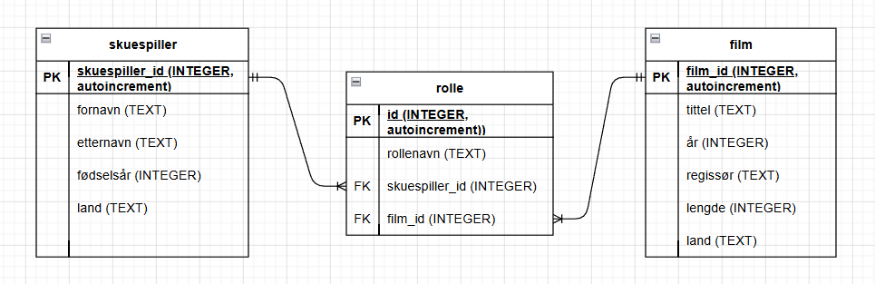

# Skuespiller-film-database

En øvingsdatabase for å lære relasjonsdatabaser og SQL. Databasen holder styr på skuespillere, filmer, og hvilke roller skuespillerne har hatt i hvilke filmer.

## 1. Datamodellen

Databasen består av tre tabeller:

| Tabell | Beskrivelse |
|---|---|
| `skuespiller` | Informasjon om hver skuespiller |
| `film` | Informasjon om hver film |
| `rolle` | Kobler en skuespiller til en film gjennom en konkret rolle |

En skuespiller kan spille i mange filmer, og en film har mange skuespillere. Dette kalles en **mange-til-mange-relasjon**, og den kan ikke lages direkte mellom to tabeller i en relasjonsdatabase. Løsningen er en **koblingstabell** i midten — her `rolle` — som har én rad per rolle, med en fremmednøkkel (FK) til hver av de to andre tabellene.

Slik ser modellen ut:



`rolle` har sin egen primærnøkkel (`id`) i stedet for at PK bare er kombinasjonen av `skuespiller_id` og `film_id`. Det gjør at samme skuespiller kan ha flere ulike roller i samme film uten at det oppstår konflikt.

## 2. Filene i denne mappen

| Fil | Hva den er til |
|---|---|
| `skuespiller_film.sql` | SQL-skriptene som oppretter tabellene og fyller dem med eksempeldata |
| `skuespiller_film.db` | En ferdigbygd SQLite-database — kan åpnes direkte, uten å kjøre SQL selv |
| `README.md` | Denne filen |

Du bør øve på å bygge databasen selv fra `.sql`-filen, eller du kan alternativt åpne `.db`-filen direkte. Fremgangsmåten under viser begge deler.

## 3. Installere Letos

Letos (tidligere kjent som SQLiteStudio) er et gratis, åpen kildekode-verktøy for å jobbe med SQLite-databaser.

1. Gå til [letos.org](https://letos.org/)
2. Last ned installasjonsfilen for ditt operativsystem (Windows, macOS eller Linux)
3. Installer og åpne programmet

## 4. Alternativ A: Åpne den ferdige databasen

Den raskeste veien til å begynne å utforske data:

1. Åpne Letos
2. Klikk **Database → Add a database** (eller ikonet med et pluss-tegn i verktøylinjen)
3. Velg **SQLite 3** som databasetype
4. Bla frem til `skuespiller_film.db` og velg den
5. Trykk **OK**

Databasen dukker opp i panelet til venstre. Klikk på pilen ved siden av navnet for å se tabellene (`skuespiller`, `film`, `rolle`), og dobbeltklikk en tabell for å se innholdet.

## 5. Alternativ B: Bygge databasen selv fra SQL-skriptet

Dette er den mest lærerike veien — her ser du hele prosessen til ferdig database.

1. Åpne Letos
2. Klikk **Database → Add a database**
3. Velg **SQLite 3**, og gi databasen et nytt filnavn og en plassering (f.eks. `skuespiller_film.db`) — dette oppretter en tom database
4. Trykk **OK**, og sørg for at den nye databasen er markert/aktiv i panelet til venstre
5. Gå til **Tools → Open SQL editor**
6. Velg `skuespiller_film.sql`
7. Bekreft at riktig database er valgt som mål ("active database"), og trykk **Execute** / **Kjør** for hver del av scriptet som du finner i filen `skuespiller_film.sql`.

Databasen dukker opp i panelet til venstre. Klikk på pilen ved siden av navnet for å se tabellene (`skuespiller`, `film`, `rolle`), og dobbeltklikk en tabell for å se innholdet.

## 6. Kom i gang med SQL-spørringer

Når databasen er koblet til, kan du åpne **Tools → Open SQL editor** og skrive SQL-setninger som henter ut data.

### 6.1 Hvordan "spørre" databasen om data

En spørring som henter data starter (nesten) alltid med `SELECT`. Den generelle oppskriften er:

```sql
SELECT kolonner        -- hvilke kolonner (felt) du vil se
FROM tabell            -- hvilken tabell dataen skal hentes fra
WHERE betingelse       -- (valgfritt) filtrer bort rader som ikke passer
ORDER BY kolonne       -- (valgfritt) sorter resultatet
LIMIT antall;          -- (valgfritt) begrens hvor mange rader du får tilbake
```

Rekkefølgen over (`SELECT` → `FROM` → `WHERE` → `ORDER BY` → `LIMIT`) er også rekkefølgen du skal *skrive* leddene i — men det er nyttig å vite at databasen selv "tenker" i en litt annen rekkefølge når den kjører spørringen: den finner først riktig tabell (`FROM`), filtrerer radene (`WHERE`), plukker ut kolonnene du ba om (`SELECT`), og sorterer til slutt (`ORDER BY`).

Så lenge du bare henter fra **én** tabell kommer du langt med oppskriften over. Men datamodellen vår har tre tabeller som henger sammen via fremmednøkler (se del 1), og mye av poenget med en relasjonsdatabase er nettopp å kunne kombinere dem. Det gjøres med `JOIN`:

```sql
SELECT kolonner
FROM tabell_a a
JOIN tabell_b b ON a.fellesnøkkel = b.fellesnøkkel;
```

`JOIN ... ON ...` sier: "for hver rad i `tabell_a`, finn raden/radene i `tabell_b` som hører sammen med den, basert på denne betingelsen." Siden `rolle` har en fremmednøkkel til både `skuespiller` og `film`, kan du bruke to `JOIN`-ledd for å koble alle tre tabellene sammen i én og samme spørring — det ser du eksempel på under.

Til slutt har SQL noen innebygde **aggregatfunksjoner** som regner ut noe *på tvers av* flere rader, i stedet for å vise hver rad for seg: `COUNT()` (antall rader), `SUM()` (sum), `AVG()` (gjennomsnitt), `MIN()` og `MAX()` (minste/største verdi). Kombinert med `GROUP BY` kan du regne ut slike tall *per gruppe* — for eksempel antall filmer per land.

### 6.2 Fire eksempler, økende kompleksitet

```sql
-- 1) Enkelt filter på én tabell
SELECT * FROM skuespiller WHERE land = 'Norge';

-- 2) Sortering på én tabell
SELECT tittel, år FROM film ORDER BY år;

-- 3) Aggregering: ett tall per gruppe
SELECT land, COUNT(*) AS antall_filmer
FROM film
GROUP BY land
ORDER BY antall_filmer DESC;

-- 4) JOIN på tvers av alle tre tabellene, med aggregering
SELECT s.fornavn, s.etternavn, COUNT(*) AS antall_roller
FROM rolle r
JOIN skuespiller s ON r.skuespiller_id = s.skuespiller_id
GROUP BY s.skuespiller_id
ORDER BY antall_roller DESC;
```

Det siste eksempelet bruker `JOIN` for å hente data fra flere tabeller samtidig, kombinert med `GROUP BY` for å telle roller per skuespiller — dette er selve poenget med en relasjonsdatabase, og noe av det viktigste å øve på videre.

### 6.3 Oppgaver

Prøv å løse oppgavene selv i SQL-editoren i Letos før du sjekker løsningsforslaget. Oppgavene blir gradvis vanskeligere — de første kan løses med det du så i eksemplene over, de siste krever `JOIN`, `GROUP BY`/`HAVING` og underspørringer.

**Oppgave 1: Vis alle skuespillerne i databasen, med alle kolonner.**

<details>
<summary>Løsningsforslag</summary>

```sql
SELECT * FROM skuespiller;
```

</details>

**Oppgave 2: Vis tittel og utgivelsesår for alle filmene.**

<details>
<summary>Løsningsforslag</summary>

```sql
SELECT tittel, år FROM film;
```

</details>

**Oppgave 3: Vis fornavn og etternavn på alle skuespillere fra Norge.**

<details>
<summary>Løsningsforslag</summary>

```sql
SELECT fornavn, etternavn
FROM skuespiller
WHERE land = 'Norge';
```

</details>

**Oppgave 4: Vis titlene på alle filmer som kom ut etter 2015.**

<details>
<summary>Løsningsforslag</summary>

```sql
SELECT tittel
FROM film
WHERE år > 2015;
```

</details>

**Oppgave 5: Vis tittel og år for alle filmer, sortert med nyeste film først.**

<details>
<summary>Løsningsforslag</summary>

```sql
SELECT tittel, år
FROM film
ORDER BY år DESC;
```

</details>

**Oppgave 6: Vis tittel og lengde for de 3 lengste filmene i databasen.**

<details>
<summary>Løsningsforslag</summary>

```sql
SELECT tittel, lengde
FROM film
ORDER BY lengde DESC
LIMIT 3;
```

`ORDER BY ... DESC` sorterer synkende (størst/nyest først), mens `LIMIT 3` kutter resultatet til de 3 første radene.

</details>

**Oppgave 7: Vis en liste over alle land som er representert blant skuespillerne — hvert land skal bare vises én gang.**

<details>
<summary>Løsningsforslag</summary>

```sql
SELECT DISTINCT land
FROM skuespiller;
```

`DISTINCT` fjerner duplikate verdier fra resultatet.

</details>

**Oppgave 8: Vis fornavn, etternavn og fødselsår for skuespillere som er født mellom 1970 og 1980 (begge år inkludert).**

<details>
<summary>Løsningsforslag</summary>

```sql
SELECT fornavn, etternavn, fødselsår
FROM skuespiller
WHERE fødselsår BETWEEN 1970 AND 1980;
```

</details>

**Oppgave 9: Vis navn (fornavn) på alle skuespillere som starter på bokstaven "A".**

<details>
<summary>Løsningsforslag</summary>

```sql
SELECT fornavn, etternavn
FROM skuespiller
WHERE fornavn LIKE 'A%';
```

`LIKE` brukes til tekstsøk. `%` er et jokertegn som betyr "hva som helst, null eller flere tegn" — så `'A%'` betyr "starter på A".

</details>

**Oppgave 10: Vis titlene på filmene som er regissert av Thomas Vinterberg.**

<details>
<summary>Løsningsforslag</summary>

```sql
SELECT tittel
FROM film
WHERE regissør = 'Thomas Vinterberg';
```

</details>

**Oppgave 11: Vis fornavn og etternavn på alle skuespillere som *ikke* er fra Norge, sortert alfabetisk på etternavn.**

<details>
<summary>Løsningsforslag</summary>

```sql
SELECT fornavn, etternavn
FROM skuespiller
WHERE land != 'Norge'
ORDER BY etternavn;
```

</details>

**Oppgave 12: Hvor mange filmer finnes det i databasen?**

<details>
<summary>Løsningsforslag</summary>

```sql
SELECT COUNT(*) AS antall_filmer
FROM film;
```

</details>

**Oppgave 13: Hva er gjennomsnittlig filmlengde (i minutter)?**

<details>
<summary>Løsningsforslag</summary>

```sql
SELECT AVG(lengde) AS gjennomsnittslengde
FROM film;
```

</details>

**Oppgave 14: Hva er utgivelsesåret til den eldste og den nyeste filmen i databasen?**

<details>
<summary>Løsningsforslag</summary>

```sql
SELECT MIN(år) AS eldste_film, MAX(år) AS nyeste_film
FROM film;
```

</details>

**Oppgave 15: Vis antall skuespillere per land, sortert med flest først.**

<details>
<summary>Løsningsforslag</summary>

```sql
SELECT land, COUNT(*) AS antall
FROM skuespiller
GROUP BY land
ORDER BY antall DESC;
```

`GROUP BY land` deler radene inn i én gruppe per land, og `COUNT(*)` telles så *innenfor* hver gruppe.

</details>

**Oppgave 16: Vis hvilke land som har mer enn én film i databasen.**

<details>
<summary>Løsningsforslag</summary>

```sql
SELECT land, COUNT(*) AS antall
FROM film
GROUP BY land
HAVING COUNT(*) > 1;
```

`HAVING` er som `WHERE`, men filtrerer på *grupper* (etter `GROUP BY`) i stedet for enkeltrader — `WHERE` kan ikke brukes sammen med aggregatfunksjoner som `COUNT()`.

</details>

**Oppgave 17: Vis fornavn, etternavn og rollenavn for alle skuespillerne som spilte i filmen "Inception".**

<details>
<summary>Løsningsforslag</summary>

```sql
SELECT s.fornavn, s.etternavn, r.rollenavn
FROM rolle r
JOIN skuespiller s ON r.skuespiller_id = s.skuespiller_id
JOIN film f ON r.film_id = f.film_id
WHERE f.tittel = 'Inception';
```

</details>

**Oppgave 18: Vis filmtittel, skuespillernavn og rollenavn for alle roller i norske filmer (der filmens `land` er "Norge").**

<details>
<summary>Løsningsforslag</summary>

```sql
SELECT f.tittel, s.fornavn, s.etternavn, r.rollenavn
FROM rolle r
JOIN film f ON r.film_id = f.film_id
JOIN skuespiller s ON r.skuespiller_id = s.skuespiller_id
WHERE f.land = 'Norge';
```

</details>

**Oppgave 19: Vis fornavn, etternavn og antall roller for skuespillere som har mer enn én rolle registrert i databasen.**

<details>
<summary>Løsningsforslag</summary>

```sql
SELECT s.fornavn, s.etternavn, COUNT(*) AS antall_roller
FROM rolle r
JOIN skuespiller s ON r.skuespiller_id = s.skuespiller_id
GROUP BY s.skuespiller_id
HAVING COUNT(*) > 1;
```

</details>

**Oppgave 20: Finn filmen med flest skuespillere registrert, og vis tittel og antall.**

<details>
<summary>Løsningsforslag</summary>

```sql
SELECT f.tittel, COUNT(*) AS antall_skuespillere
FROM rolle r
JOIN film f ON r.film_id = f.film_id
GROUP BY f.film_id
ORDER BY antall_skuespillere DESC
LIMIT 1;
```

</details>

**Oppgave 21: Vis fornavn og etternavn på skuespillerne som har spilt i en film fra et *annet* land enn landet de selv er fra.**

<details>
<summary>Løsningsforslag</summary>

```sql
SELECT s.fornavn, s.etternavn
FROM skuespiller s
JOIN rolle r ON s.skuespiller_id = r.skuespiller_id
JOIN film f ON r.film_id = f.film_id
WHERE f.land != s.land;
```

Her sammenligner vi `land`-kolonnen i to forskjellige tabeller i samme spørring — noe som bare er mulig fordi vi har koblet dem sammen med `JOIN`.

</details>

**Oppgave 22: Vis fornavn og etternavn på skuespillerne, sammen med hvor mange roller de har — inkludert skuespillere som ikke har noen roller i det hele tatt (0 roller).**

<details>
<summary>Løsningsforslag</summary>

```sql
SELECT s.fornavn, s.etternavn, COUNT(r.id) AS antall_roller
FROM skuespiller s
LEFT JOIN rolle r ON s.skuespiller_id = r.skuespiller_id
GROUP BY s.skuespiller_id
ORDER BY antall_roller ASC;
```

Et vanlig `JOIN` (`INNER JOIN`) viser bare skuespillere som *har* minst én rolle. `LEFT JOIN` tar med *alle* radene fra `skuespiller`, uansett om det finnes en matchende rad i `rolle` eller ikke — hvis det ikke finnes noen match, blir kolonnene fra `rolle` `NULL`. Merk `COUNT(r.id)` i stedet for `COUNT(*)`: `COUNT(r.id)` teller bare rader der `r.id` faktisk har en verdi (altså ikke `NULL`), mens `COUNT(*)` ville talt alle rader — også de uten rolle. I denne datasettet har alle skuespillere minst én rolle, så alle vil vise 1 eller flere, men spørringen ville fungert korrekt selv om noen manglet.

</details>

**Oppgave 23 (ekstra utfordring): Finn alle par av skuespillere som har spilt i samme film, og vis navnene deres sammen med filmtittelen. Hvert par skal bare vises én gang.**

<details>
<summary>Løsningsforslag</summary>

```sql
SELECT s1.fornavn, s1.etternavn, s2.fornavn, s2.etternavn, f.tittel
FROM rolle r1
JOIN rolle r2 ON r1.film_id = r2.film_id AND r1.skuespiller_id < r2.skuespiller_id
JOIN skuespiller s1 ON r1.skuespiller_id = s1.skuespiller_id
JOIN skuespiller s2 ON r2.skuespiller_id = s2.skuespiller_id
JOIN film f ON r1.film_id = f.film_id;
```

Dette kalles en **selv-join**: tabellen `rolle` kobles mot seg selv (`r1` og `r2`) for å finne par av rader som deler samme `film_id`. Betingelsen `r1.skuespiller_id < r2.skuespiller_id` sørger for at vi ikke får hvert par to ganger (én gang som A–B og én gang som B–A), og at en skuespiller ikke parres med seg selv.

</details>

## 7. Merk om eksempeldataen

Datasettet blander ekte skuespillere og filmer med noen forenklede eller fiktivt tilpassede rollenavn, laget for å gi gode øvingsmuligheter til JOIN-spørringer.